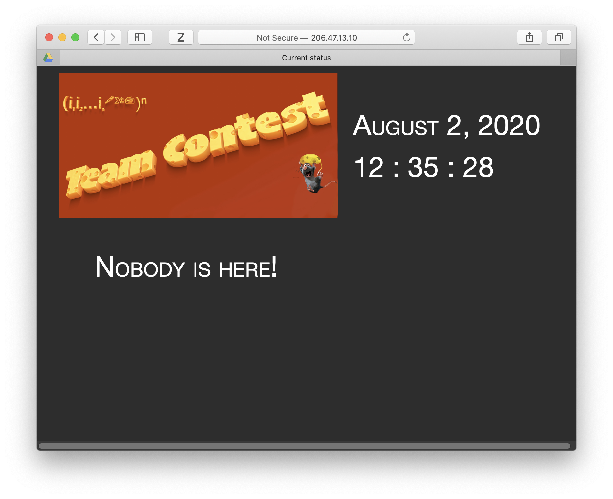
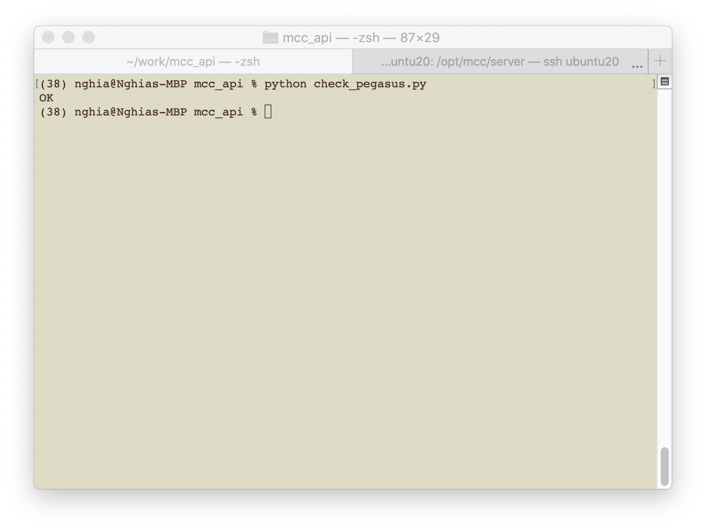
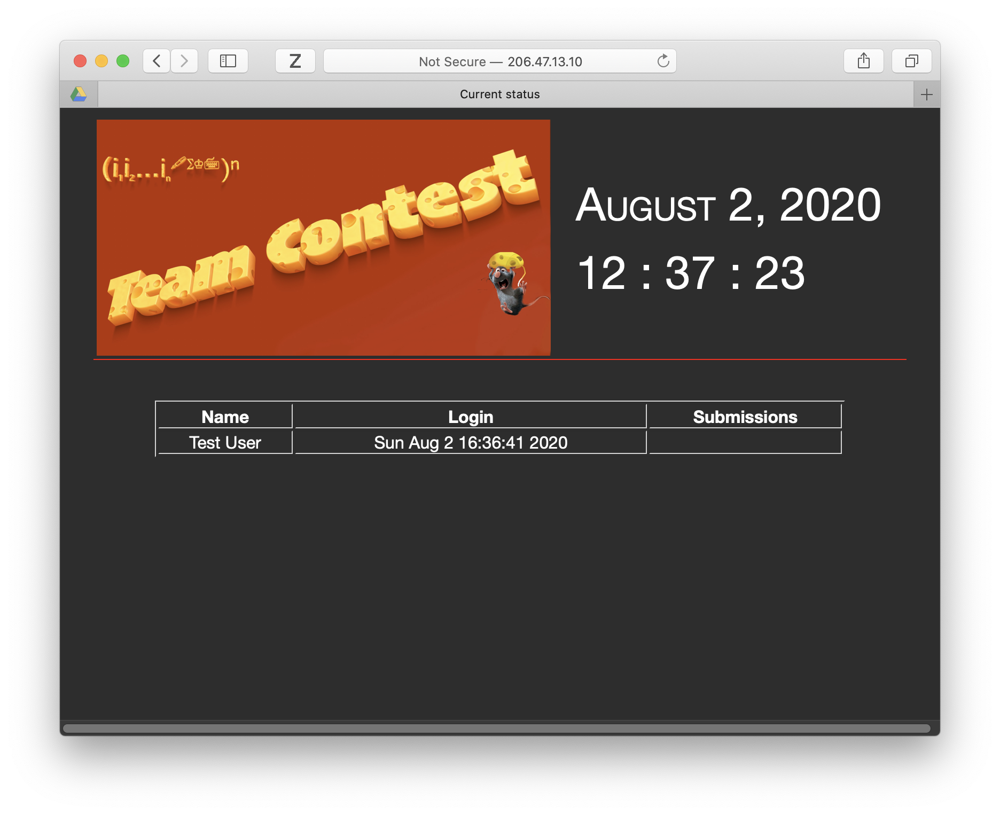

# Tools to participate in MCC's Python Coding Contest

This is an Python module which facilitates the communications between the Python applications designed by students of [Math & Chess Club in Ottawa](https://online2learn.wordpress.com/) and the [Evaluation Server, a.k.a Astria](http://206.47.13.10:8080).

## Prerequisites
1. Install Python on your computer. Here is a good place to start with [Install Python 3](https://installpython3.com). Use Python 3.8+.
2. Create a virtual environment. Think of it as an place where you have all of your Python interpreter, modules, etc ready to be used. Follow instruction on the official document of [Virtual Environments and Packages, Python 3.8.5](https://docs.python.org/3/tutorial/venv.html). Give it an easy-to-remember name, for example '385' and place it at an easy-to-access place.
3. Follow instruction on the previous page to activate the virtual environment. Remember that you have to *activate the virtual environment every time before you start using Python for coding in that environment*.
4. Install the Python ```requests``` module:

        pip install requests
5. Download the `mcc_api` package, which is this repository, by click on the green `Code` button on this page, [download it] (https://github.com/nghia71/mcc_api/archive/master.zip), unzip it into a folder where you are going place your Python scripts.

## Connect to Astria and check if Pegasus is ready
1. Download your personal access from the assigned folder on the club's Google drive. It should be inside the `Astria` directory with your name as part of the file name. For example:

        anthony_ly.conf
2. Download that file into the local folder on your machine, this is the folder you have unzipped the `mcc_api`. Rename it to `mcc.conf`.
In Windows's Command Prompt:

        ren anthony_ly.conf mcc.conf
In Mac OS X's or (Ubuntu) Linux's Terminal:
        mv anthony_ly.conf mcc.conf

3. Test Pegasus if it is ready
First, open a tab on your favourite browser by clicking on this link to [Astria](http://206.47.13.10:8080).

You should see the screen similar to below:


Second, in the Command Prompt or Terminal, run:
        python check_pegasus
You should see `OK`, if you have configured Pegasus correctly:


Now on the browser tab, an entry with your name and login time should appear:


## Complete the Test Run
In order to join the club's Python Coding Contest, you should complete the test run. This requires good competent coding skills which you might already acquired through the `Beauty and Joy of Computing` course, plus self-learning Python. However without proper `problem solving skills` you might find it hard to pass.

The test run is consists of three problems, described as below. In order to pass the test run, you need to develop further the given ```test_run.py```, that can be found in the folder (where the `mcc_api` repository was unpackaged).

The test run has an implicit `main` function, which is ran every time when you run the script. It starts with:

    if __name__ == '__main__':

It first setup `Pegasus` (the communication facilitator) to communicate with `Astria` (the evaluation server).

    # Setup your credentials
    p = Pegasus('mcc.conf')

Note that now you have an variable `p`, which is an instance of a `Pegasus`, think of it as your messenger to `Astria`

Then it gives you four examples of submitting for three given problems.

***It is important to know that***:
- your submissions have to pass the test run: when you see the status on the `Astria` site shows that you passed all three problems
- you have submitted that working code into your assigned folder on the club's drive.

*Note 1: You can team up with one (not more than one) person to work and solve these three problems.*
*Note 2: You can ask someone for ideas, code syntax problems, etc. You should not ask other people to write, dictate, or copy codes from other sources. Remember you learn for yourself and in the challenges, there are no one to help you, except perhaps your teammates.*

### Problem One: Find the next prime
#### The problem: *Given an positive integer, find the next prime that is equal or larger than the given number.*

To find the next prime, a `sample implementation` is given, which is by no mean a good implementation or an optimal implementation.

The function `my_next_prime` receives a positive integer and try to check if that is a number, if not then it increases the number by 1, and then check again. This process is repeated until the number is a prime.

    #
    # This implementation is only to demonstrate how to write such a function
    #
    def my_next_prime(number):
      next_prime = number
      found_prime = False

      while not found_prime:
          found_prime = is_prime(next_prime)
          if found_prime:
              return next_prime
          next_prime += 1

This implementation uses a helper function to determine if a number is a prime:

    #
    # This is a simple implementation, it works but not a good one
    #
    def is_prime(number):
        for i in range(2, number-1):
            if number % i == 0:
                return False
        return True

Obviously both functions are so call `reference implementation` and not aiming for perfection. Using these to find the next prime after one billion would take quite an amount of time.

The key point here is that `my_next_prime` function must return a positive integer, that is supposed to a prime and is larger or equal the given number.

Two examples are given for how to submit for this problem:

The first one is for testing if an answer is correct, for example 11 is the next prime after the number 10.

    # Solve the first problem and submit
    result = p.submit('next_prime', 10, 11)
    print(result)

You can see here how `p` is used with its member function `submit`. The `submit` function is called with three arguments:
- `'nextprime'` as a string, this is the identifier of the `next_prime` problem. You should always has it as the first argument when using the `submit` function.
- `10` as an integer, this is the input, in this problem is the given `number`
- `11` as an integer, this is the output, in this problem is the `next prime` found by you.

Obviously you cannot write endlessly number of lines, each for a concrete case such as 10, 11, 12, ... because there are just infinitely many integers and your time is limited.

The second example:

    my_number = 100
    result = p.submit('next_prime', my_number, my_next_prime(my_number))
    print(result)

is different in the way that `my_number` now is a variable representing the number 100, this variable is given to the function `my_next_prime` as an input argument so that this function now uses this argument to calculate the next prime, and when that is found, return the found prime.

The example implementation will work, and if you run the code, you will see two `OK`s are printed out. That means that the code is correctly implemented.

Is this problem solved? No. In the above only a so-called `static example` for (`10`, `11`) and a `functional test` for the case of `100`.

##### The task: *Your implementation of my_next_prime has to find the next prime after one billion (nine zeroes after one)*

So you have to implement the `my_next_prime` function and make sure that it works for the below. Uncomment by removing the # comment in front of the last two lines of the code below.

    ########################################
    # Task for the next_prime problem: uncomment and make them work
    #
    my_number = 1000000000
    result = p.submit('next_prime', my_number, my_next_prime(my_number))

Note: you need to use your skills obtained from the `Beauty and Joy of Computing` to invent a good algorithm. The sample implementation given above can run forever.

### Problem Two: Find the fake coins
#### The problem: *There are eight identical-looking coins. One of them is a counterfeit (a fake coin) and lighter than the others. What is the minimum number of weighings needed to identify the fake coin with a two-pan balance scale and without weights? You are given a string of seven 1's and one 0. You have to simulate a weighing process to find the position of the fake coin.*

In the code you can see an example implementation

    my_coins = '10111111'
    result = p.submit('fake_coin', my_coins, my_fake_coin(my_coins))
    print(result)

So you *knows* that the second coin, or the second character with index 1 in the '10111111' string is a '0'. But of course you have to implement a function to determine this fake coin via weighing, not by looking into the string.

An incomplete implementation of `my_fake_coin` function is given:

    #
    # This is an incomplete implementation. The test run fails in most of the cases.
    #
    def my_fake_coin(coins):
        if int(coins[0]) < int(coins[1])
          return 0
        return 1

In this implementation, the first coin and the second coin are obtain by getting the first and second characters from the string, converting them to integers and comparing them. If the first coin is 0 and the second is 1, then it will return 0 as the position of the fake coin, otherwise 1 as position of the fake coin. Of course this implementation is incomplete and will not work in most of the cases.

##### The task: *Your implementation of my_fake_coin has to find the fake coin with a given random string representing the order of the coins*

Similar to the first problem, now you have to create an  implementation for `my_fake_coin` and make sure that it work with the tast.

    ########################################
    # Task for the fake_coin problem: uncomment and make them work
    #
    # coins = ['0', '1', '1', '1', '1', '1', '1', '1']
    # shuffle(coins)
    # my_coins = ''.join(coins)
    # result = p.submit('fake_coin', my_coins, my_fake_coin(my_coins))
    # print(result)

### Problem Three: Find the sequence of moves
#### The problem: *A knight stand on a square in the 3x3 chessboard. The squares on the board are number 1 to 9 from the top to the bottom row and from left to right. The number of the square where the knight stands is the position of the knight. Given the position, find the sequence of numbers that representing the squares the knight visit, each once, before return to the original squares.*

Again, a sample position is given

    ########################################
    # Sample test for the move_sequence problem
    #
    my_position ='7'
    result = p.submit('move_sequence', my_position, my_move_sequence(my_position))
    print(result)

with an fake implementation

    #
    # This is a fake implementation, it always return '4'. The test run will fail.
    #
    def my_move_sequence(position):
        return '12345678'

##### The task: *Your implementation of my_move_sequence has to determine the sequence of move as a string of digits*

    ########################################
    # Task for the move_sequence problem: uncomment and make them work
    #
    # my_position = choice(['1', '2', '3', '4', '6', '7', '8', '9']
    # result = p.submit('move_sequence', my_position, my_move_sequence(my_position))
    # print(result)

## Recording of results and submissions
`Astria` records all your submissions. Every single one. She also keeps the final submission of each problem.

## Evaluation of submissions
*If all final submissions are correct AND your submitted codes work accordingly, you are admitted into the contest.*
***Congratulation!***
